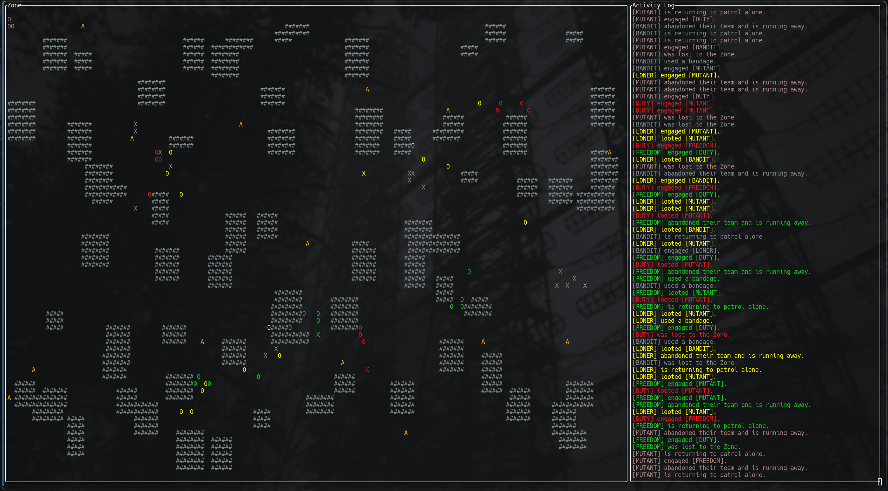

# A-Life Simulator

CLI simulation inspired by <i>GSC Game World's A-Life</i> system from <i>S.T.A.L.K.E.R.</i>, rendered using FTXUI.

## Build
```sh
git clone https://github.com/Z-CQ/a-life-simulator.git
cd a-life-simulator
cmake -S . -B build
cmake --build build
```

A makefile is also present; if you have `ftxui` installed, you can run `make`.



## Features

- Multi-faction simulation (Loner, Duty, Freedom, Bandit, Mutant)
- Dynamic faction relations (based on GAMMA)
- Activity log with real-time agent actions
- Terminal-size adaptive rendering
- Adjustable spawn counts and tick speed

## Usage
`./build/main` with CMake<br>
`./main` with Make

The simulation will run with zero human input. 

The faction selection has been kept low for simplicity. To add more, see `/src/headers/Factions.h` and `/src/Factions.cpp`.

Simulation width and height are determined by terminal size, with 74 characters reserved width-wise for an activity log, which populates with agent actions.
<i>Because of this, it is recommended to keep your terminal fairly zoomed out.</i>

To change spawn counts or simulation speed, see `/main.cpp`. The `TICK_SPEED_MS` macro controls the delay of each simulation tick in milliseconds.
The Zone spawn parameters are listed in the comment above the `Zone.populate` call. Adjust these to your liking.
Similarly, you can adjust agent counts for teams in `/src/Zone.cpp` at the top of the `Zone::Populate` function.

The API is <i>fairly</i> readable & usable. All methods are documented. Feel free to use this for whatever or expand upon it.

## Notes
Planned: campfire interaction (targeting, movement, resting behavior).
